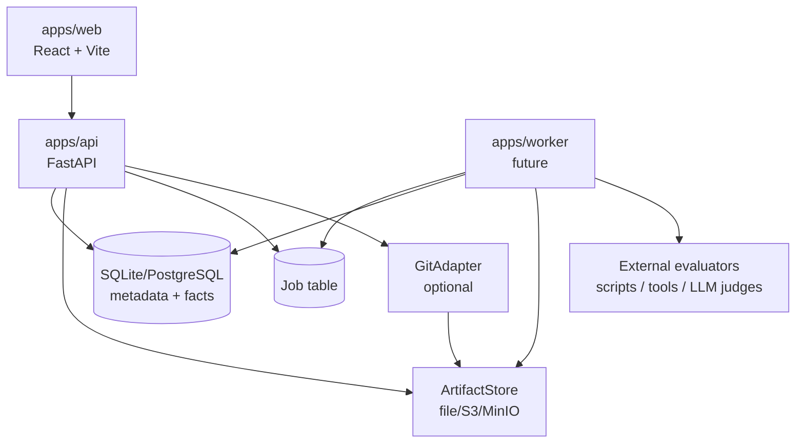
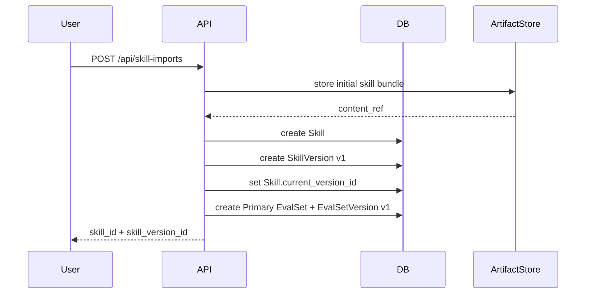
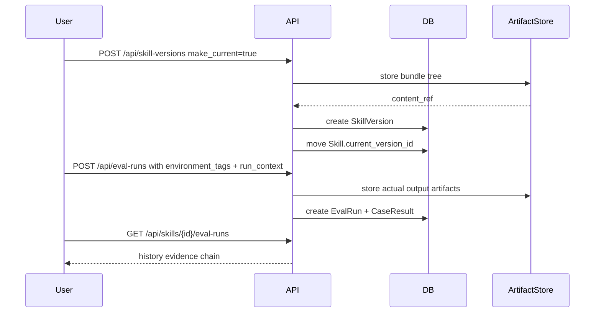

# SkillHub 架构说明

本文档描述当前正式版工程架构。核心模型是 `Skill -> SkillVersion -> EvalRun(context) + EvalSetVersion`：内容版本保持不可变，运行环境差异只记录在每一次测评运行上。

## 1. 产品目标

当前版本不追求做完整平台，而是把“可验证的 Skill 内容版本”做成正式工程闭环：

```text
用户能创建标准 Skill bundle，
给 Skill 追加不可变 SkillVersion，
维护带版本的 eval set，
在不同运行环境下记录 EvalRun，
最终在 Hub、版本页、测评页和历史页看到可追溯证据。
```
核心承诺：

- 分发入口简单，Skill 是稳定入口。
- 内容证据严谨，所有结果绑定精确 `SkillVersion + EvalSetVersion + run_context`。
- 内容存储可替换，Git 可以接入但不是前置依赖。
- 测评策略可插拔，平台先记录标准结果，再逐步执行更多策略。

## 2. 系统边界



边界规则：

- Web 不直接读数据库。
- Worker 不绕过领域服务写事实。
- ArtifactStore 不保存业务关系，只保存不可变内容。
- GitAdapter 不改变 `Skill / SkillVersion / Eval` 模型，只提供内容树读写和 diff。

## 3. 领域对象

```mermaid
erDiagram
  Skill ||--o{ SkillVersion : has
  Skill ||--o{ EvalSet : owns
  EvalSet ||--o{ EvalSetVersion : has
  Skill ||--o{ EvalCase : owns
  EvalCase ||--o{ EvalCaseVersion : has
  EvalSetVersion ||--o{ EvalSetCaseVersion : includes
  SkillVersion ||--o{ EvalRun : evaluated_by
  EvalSetVersion ||--o{ EvalRun : used_by
  EvalRun ||--o{ CaseResult : has
  EvalCaseVersion ||--o{ CaseResult : result_for
  EvalRun ||--o| AcceptedVerification : accepted_as
```



关键语义：

- `Skill` 是稳定入口，保存 `current_version_id`。
- `SkillVersion` 是不可变内容快照，append-only。
- `EvalCaseVersion` 是不可变测试用例快照。
- `EvalSetVersion` 是 case version 列表快照；未被 `EvalRun` 使用的当前版本是可编辑工作版，首次运行后锁定为历史快照。
- `EvalRun` 是一次 exact `SkillVersion + EvalSetVersion + run_context` 的证据。
- `CaseResult` 只记录该 run 下某个 case version 的最终结果和 actual output artifact。
- `AcceptedVerification` 指向一次 finished run，并按 `run_context_hash` 区分不同运行环境。

## 4. 数据所有权

### Metadata DB

数据库是事实源，负责：

- identity：所有对象 id。
- relationship：对象归属和引用。
- pointer：`skills.current_version_id`、`eval_sets.current_version_id`、`eval_cases.current_version_id`。
- immutable fact：Skill version、eval set version、eval run、case result。
- permission：角色授权。
- job：异步任务状态。
- query index：Hub、版本、Eval Run 和历史页面所需读模型。

### ArtifactStore

ArtifactStore 是内容源，负责：

- 标准 Skill 文件树。
- case input。
- expected output。
- actual output。
- eval import 原始 payload。
- eval report、日志、transcript。
- bundle diff 所需的不可变快照。

ArtifactStore locator 必须不可变。数据库保存：

- `artifact_id`
- `kind`
- `locator`
- `digest`
- `media_type`
- `size`
- `created_at`
- `created_by`

### GitAdapter

GitAdapter 只做内容协作：

- 把标准 Skill 文件树写成 commit。
- 从 commit 读取文件树。
- 计算 commit/tree diff。
- 后续支持 review 工作流。

`SkillVersion.content_ref` 可以指向 Git commit，但不能指向 branch。

## 5. 模块结构

后端结构：

```text
apps/api/skillhub/
  domain/
    models.py
    errors.py
    policies.py
  application/
  infrastructure/
    db/
      tables.py
      indexes.py
      repositories.py
      repository_parts/
    artifact_store/
  api/
```

模块职责：

| 模块 | 职责 |
| --- | --- |
| `domain` | 领域对象、不变量、权限规则，不依赖 FastAPI/SQLAlchemy |
| `application` | 写入命令和页面读模型的应用层入口 |
| `infrastructure.db` | SQLAlchemy metadata、repositories、transactions |
| `infrastructure.db.repository_parts` | repository 的写命令、读模型、权限、history 和 diff 具体实现 |
| `infrastructure.artifact_store` | file/S3/MinIO artifact adapter |
| `api` | HTTP 边界、request/response schema、actor dependency |

`skillhub.infrastructure.db.repositories.SqlSkillRepository` 是对外兼容入口。它只组合 mixin，不承载具体 SQL 逻辑；新代码应优先放入 `repository_parts/` 中对应职责文件。

## 6. API 形态

页面查询返回 denormalized view data，避免前端拼低层对象。

### 页面查询

| Endpoint | 返回 |
| --- | --- |
| `GET /api/skills` | Hub 列表摘要 |
| `GET /api/skills/{skill_id}` | Skill 详情、versions、eval sets、latest eval runs |
| `GET /api/eval-set-versions/{version_id}` | Eval set version 详情和具体 case 内容 |
| `GET /api/skills/{skill_id}/eval-runs` | 历史 run 列表 |
| `GET /api/skills/{skill_id}/eval-run-matrix` | 按版本和测评集过滤的 run matrix |
| `GET /api/eval-runs/{run_id}` | Eval run 详情和逐 case 结果 |
| `GET /api/eval-runs/compare` | 两个 finished run 的修复/回退比较 |
| `GET /api/artifacts/diff` | 两个 SkillVersion bundle 的 diff |

### 命令写入

| Endpoint | 命令 |
| --- | --- |
| `POST /api/skills` | 创建 Skill、初始 SkillVersion、主 EvalSet |
| `POST /api/skill-imports` | 从标准 Skill bundle 导入 Skill |
| `PATCH /api/skills/{skill_id}` | 更新 Skill 元数据或当前版本指针 |
| `DELETE /api/skills/{skill_id}` | 归档 Skill |
| `POST /api/skill-versions` | 创建不可变 SkillVersion，可选择是否 make current |
| `POST /api/eval-cases` | 创建 case 和 case version；当前 EvalSetVersion 未运行时原地更新，已运行时生成新快照 |
| `POST /api/eval-cases/batch` | 批量创建 case；同样遵循工作版/已锁定规则 |
| `POST /api/eval-case-versions` | 修正 case 内容，生成新 case version；必要时生成新 eval set version |
| `PATCH /api/eval-cases/{case_id}` | 编辑 case 并生成新 case version |
| `POST /api/eval-cases/{case_id}/restores` | 从历史 case version 恢复 |
| `DELETE /api/eval-cases/{case_id}` | 归档 case |
| `POST /api/eval-runs` | 记录手工 pass/fail run、运行环境和 actual output |
| `POST /api/eval-runs/accepted-verifications` | 把一次 finished run 接受为当前上下文验证依据 |

## 7. 核心流程

### 创建 Skill



### 追加内容版本并测评



## 8. 不变量

- `SkillVersion` 创建后不更新内容字段。
- `EvalCaseVersion` 创建后不更新 input、expected output 和 notes。
- 未被任何 `EvalRun` 使用的当前 `EvalSetVersion` 可以更新包含的 case version 列表；已有运行记录的 `EvalSetVersion` 不再更新，后续 case 变更创建新快照。
- `EvalRun` finished 后不改 `skill_version_id`、`eval_set_version_id`、`strategy`、`environment_tags` 或 `run_context_hash`。
- `Skill.current_version_id` 只能指向同一 Skill 下的 `SkillVersion`。
- `EvalRun.skill_version_id` 和 `EvalRun.eval_set_version_id` 必须属于同一个 Skill。
- `AcceptedVerification` 的唯一上下文是 `(skill_id, skill_version_id, eval_set_version_id, run_context_hash)`。
- Bundle diff 只能比较同一个 Skill 的两个 `SkillVersion`。

## 9. 权限边界

| 操作 | 需要角色 |
| --- | --- |
| 创建 Skill | 任意本地 actor |
| 创建 SkillVersion | owner / maintainer |
| 管理 case | owner / maintainer |
| 记录 EvalRun | owner / maintainer / evaluator |
| 接受验证 | owner / maintainer |
| 管理角色 | owner |
| 归档 Skill | owner |

前端只能根据 `SkillCapabilities` 展示或禁用动作；后端 mutation endpoint 必须重新校验权限。

## 10. 存储

当前本地默认使用文件型 SQLite，数据库在启动时通过 SQLAlchemy metadata 初始化：

- `skills.current_version_id`
- `skill_versions`
- `eval_runs.skill_version_id`
- `eval_runs.environment_tags`
- `eval_runs.run_context`
- `eval_runs.run_context_hash`
- `accepted_verifications.skill_version_id`
- `accepted_verifications.run_context_hash`

当前项目仍处于开发阶段，不启用独立 Alembic migration 流程。schema 初始化和 SQLite 兼容补丁由启动代码处理。

## 11. 读模型

| View | 页面 |
| --- | --- |
| `SkillSummary` | Hub 首页 |
| `SkillDetail` | Skill 概览、版本、测评集、测评页 |
| `EvalSetVersionDetail` | 测评页和测评集详情 |
| `EvalRunHistory` | 历史页侧栏 |
| `EvalRunDetail` | 历史页 case 证据 |
| `BundleDiff` | 版本页 diff inspector |

读模型可以 denormalize，但不能改变事实源的不变量。前端不应根据当前指针推断历史 run 的内容版本，必须使用 run 里绑定的 `skill_version_id`。

## 12. 验收标准

- 干净 clone 后 `bash scripts/dev.sh` 自动创建文件型 SQLite。
- 刷新或重启后 Skill、SkillVersion、EvalRun、history 数据仍在。
- 历史页能看到实际 eval run 和 case result。
- Bundle diff 使用真实 API 数据和可点击 UI。
- 手工测评每个 case 可输入 actual output，并显示 actual vs expected 对比。
- `environment_tags` 和 `run_context` 出现在 EvalRun 记录和历史证据中。
- 320px 到桌面宽度无关键组件穿出或遮挡。
- API/Web 单测、lint 和 build 通过。
