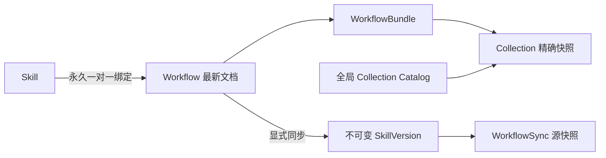

# Workflow 作者模型与 SkillHub 集成规范

## 1. 文档目的

本文定义 SkillHub 中 Workflow 的作者模型、持久化边界和同步语义。它面向产品、前端、后端、测试和后续执行器开发，确保同一概念在编辑器、API、数据库和生成的 Skill 中保持一致。

权威性分工：

- 本文定义概念、关系和不变量。
- `apps/backend/skillhub/models/rules/workflows/schema.py` 定义服务端可接受的持久化结构。
- `apps/frontend/src/types/workflow.ts` 和 `features/workflow/domain/schema.ts` 是前端镜像。
- `workflows.document_schema_version` 标识持久化格式；当前只接受 schema v3，`WorkflowBundle` 内不保存格式版本。
- Workflow 只表达作者内容，不表达执行器运行状态。

## 2. 与 Skill 的关系



约束：

- Workflow 不能独立存在，只能在创建 Skill 时建立绑定。
- `workflows.skill_id` 唯一且创建后不可修改。
- 不支持后补绑定、解绑或换绑。
- Skill 是 `slug`、`owner_ref`、平台 Tag、权限和归档状态的唯一真源。
- Workflow 与 Skill 共享设置、用户权限、Skill Tags 和授权机制。
- 版本、测评集、测评、评审和发布只作用于同步生成或手工维护的 SkillVersion。

## 3. 持久化模型

### `workflows`

每个 Workflow 只保留最新文档：

- `id`
- `skill_id`
- `revision`
- `document_schema_version`
- `document`
- `document_digest`
- `created_by / created_at`
- `last_saved_by / updated_at`

保存由用户显式触发。服务端不自动保存，前端不写 localStorage。相同内容且没有 Collection 变更时是幂等 no-op，不增加 revision。

### `workflow_syncs`

每次成功同步记录：

- 精确 `workflow_id + workflow_revision`
- 外部 `document_schema_version`
- 完整 Workflow 源快照 artifact
- 生成的 `skill_version_id`
- `generator_version`
- 操作者和时间

同一个 Workflow revision 只生成一次 SkillVersion。重复同步时，如果原版本不是当前版本，则重新激活；已经是当前版本时直接 no-op。

### Collection Catalog

全局 Catalog 使用不可变 revision：

- `workflow_collection_definitions` 保存稳定 ID 和最新 revision 指针。
- `workflow_collection_revisions` 保存每个精确版本的定义和 digest。
- `create` 与 `fork` 从 revision 1 开始。
- `revise` 在同一 ID 下创建下一 revision。
- 持久化定义不提供删除或归档 API。

Workflow 保存与本次 Collection `create/revise/fork` 在同一数据库事务中完成。

步骤编辑器允许直接新建 Collection。该操作只在当前前端编辑会话中创建待提交定义和对应 CollectionCall，不会立即调用后端；用户显式保存 Workflow 时，定义、调用引用和 Workflow 文档才会原子写入。放弃修改不会在全局 Catalog 留下定义。

## 4. 标识体系

| 标识 | 用途 | 稳定性 |
| --- | --- | --- |
| `id` | 结构引用、绑定关系和对象身份 | 创建后稳定，用户不直接编辑 |
| `key` | 参数、命令模板和采集数据引用 | 作用域内唯一 |
| `name` | 页面、预览和生成文档中的显示名称 | 可自由修改，不用于结构引用 |

Key 唯一性作用域：

- Workflow 输入和 DeviceRole 的 Key 分别唯一。
- CollectionCall 的 Key 在所属 Step 内唯一。
- CollectionDefinition 的 Key 由 Catalog 维护。
- Collection 输入和输出 Key 在各自定义内唯一。

Step、Conclusion 和 Transition 不保存 Key。节点之间的关系只通过创建后不可修改的内部 ID 建立，节点名称可以重复。

## 5. WorkflowBundle

```text
WorkflowBundle
  documentType: "workflow_bundle"
  workflow: Workflow
  collectionSnapshots: CollectionDefinition[]
```

Bundle 只携带当前 Workflow 直接引用的 Collection 精确版本。共享 Catalog 不属于 Bundle。

快照约束：

- 每个 CollectionCall 的 `VersionedRef` 必须可解析。
- 相同 `id + revision` 最多出现一次。
- 未被当前 Workflow 引用的定义不进入快照。
- `forkedFrom` 只记录来源身份，不要求携带来源快照。

## 6. WorkflowMetadata

`WorkflowMetadata` 只包含：

- `name`
- `code`
- `description`
- `symptom`
- `industry`
- `device`
- `versions`

`symptom` 是可选的问题现象说明，用于记录告警、用户感知或触发条件。它随 Workflow 文档保存和导入，但不进入阅读预览或同步生成的 `SKILL.md`。

`owner_ref`、Skill Tags、权限、生命周期和归档状态不得写入 WorkflowMetadata。

编辑器基础信息页可以维护外层 Skill Tags。Tag Group 加载、级联/自由值校验和保存均复用 Skill 现有能力；点击 Tag Picker 的“完成”会独立更新 Skill，不修改 Workflow revision、dirty 状态或撤销历史。“保存 Workflow”也不会代替保存 Skill Tags。

## 7. 作者概念

### Parameter

Parameter 声明 Workflow 全局输入或 Collection 输入槽位，包含 `id/key/name/description/dataType/required`，不保存运行时值。Step 不再声明独立输入。

编辑器新建 Workflow 全局输入时固定 `required: true` 且不提供切换控件。Schema 和导入接口仍保留 `required` 字段，Collection 输入继续允许作者配置该值。

### Binding

Binding 只保存参数来源关系：

| `kind` | `reference` | 语义 |
| --- | --- | --- |
| `workflow_input` | `{ input_id }` | Workflow 全局输入 |
| `collection_output` | `{ call_id, output_id }` | 当前 Step 内采集调用的输出 |
| `literal` | `{}` + `value` | 作者填写的 JSON 字面量 |

校验器负责检查引用存在性。生成 Skill 时使用参数的可读 Key 和 Name，不输出内部 ID。

### DeviceRole

DeviceRole 描述逻辑设备角色。`required` 表示未来使用 Workflow 时是否必须提供实际设备；作者模型不保存角色到设备的运行时映射。

### CollectionDefinition

CollectionDefinition 包含稳定 `id + revision`、元信息、输入、输出、类型专属 spec 和可选 `forkedFrom`。当前唯一采集类型是 CLI。Collection 输出只包含 `id/key/dataType/description`，其中 Key 同时承担字段名称和表达式引用身份。

CLI spec 包含：

- `commandTemplate`
- `outputSamples`
- `collectionType: "cli"`

原始 `stdout` 和 `inputValues` 只用于作者预览，不写入同步生成的 SKILL.md；生成结果只列出样例名称。

### CollectionCall

CollectionCall 表示某个 Step 对 CollectionDefinition 精确版本的一次使用，保存可选调用 Key/Name、Definition 引用、设备角色、采集次数和参数绑定。未选择设备角色时表示“单设备”。调用名称为空时展示 Collection 名称；调用 Key 非空时作为输出字段命名空间，例如 `status.version`，为空时直接暴露输出字段。直接暴露的字段不得与 Workflow 全局输入或其他直接暴露输出重名。

数组顺序只用于写作和阅读，不表达串行、并行、优先级或调度顺序。

### 步骤内新建 Collection

步骤内新建时：

1. 新定义继承 Workflow 的产业、设备和适用版本，输入参数和绑定默认为空。
2. 同时创建当前步骤的 CollectionCall，并把定义加入会话 Catalog，供其他步骤立即复用。
3. 调用名称和 Key 默认为空；名称回退显示 Collection 名称，Key 仅在需要输出命名空间时填写。
4. 保存前删除最后一个调用引用时，同时移除待提交定义；仍有其他步骤引用时只删除当前调用。
5. 参数 Key/名称、Collection 名称或单行 CLI 命令缺失会产生领域 `error`：允许保存草稿，但阻止同步到 Skill。

### Step、Transition 与 Conclusion

- Step 是判断节点，可为 `expression` 或 `script`。跳转条件表达式支持 `global.<key>` 和 `output.<callKey>.<outputKey>` 变量补全；补全覆盖所有步骤已定义的采集输出，仅用于辅助输入，不承担运行时校验。
- Script 只保存作者草稿，不定义运行环境、权限、超时和返回协议。
- Transition 通过目标 ID指向 Step 或 Conclusion，只保存自然语言条件和表达式源码；在编辑器中表述为“跳转到节点”，条件说明为空时表示无条件跳转。
- Conclusion 是终点知识节点，只保存根因和修复建议。
- Workflow 可以声明多个起始 Step。

## 8. Copy-on-edit

从 Step 内第一次修改共享 CollectionDefinition 时，编辑器原子执行：

1. 复制当前精确版本并分配新 ID。
2. 新副本 revision 设为 1。
3. 写入 `forkedFrom`。
4. 应用修改。
5. 将当前 CollectionCall 重绑到副本。
6. 更新 Bundle 精确快照。

撤销必须同时撤销副本创建、调用重绑和快照变化。修改已 fork 的副本时继续编辑同一草稿。

## 9. 编辑历史与保存

撤销/重做历史覆盖 WorkflowBundle、会话 Catalog 和待提交 CollectionChanges。

以下 UI 状态不进入历史或持久化文档：

- 当前选择与展开状态。
- 预览 Tab、图谱视口和方向。
- 弹窗、三栏宽度、折叠状态和通知。
- 保存中、同步中等请求状态。

保存成功后，后端分配正式 revision 并返回规范化文档。前端使用该文档建立新基线，同时清空撤销/重做历史。

## 10. 校验语义

保存请求严格校验 JSON 结构。领域 `error/warning` 可以随草稿保存：

- `error` 阻止同步。
- `warning` 允许同步。

典型错误包括：无起始步骤、重复 ID、参数 Key/名称缺失、参数或采集 Key 重复、多行采集命令、无命名空间输出冲突、无效节点或 Collection 引用、缺少必填绑定、无效设备角色和采集次数小于 1。

典型 warning 包括：不可达节点和潜在循环。

## 11. 同步到 Skill

同步是显式操作，且 dirty 状态禁止同步。转换器是后端纯规则模块，只生成单文件 `SKILL.md`：

- frontmatter `name` 使用同步时的 Skill slug。
- frontmatter `description` 使用 Workflow description，并通过 YAML 序列化器输出。
- 正文确定性渲染元信息、输入、设备角色、步骤、采集、命令模板、绑定、输出、路径、脚本草稿和结论。
- 节点关系使用 Name，参数和采集关系使用可读 Key/Name，不输出 opaque ID。
- 不写入 `workflow.json`。
- 不合并当前手工 SkillVersion；每次同步生成完整新 bundle。

同步事务同时写入源快照、生成 artifact、SkillVersion、当前版本指针和审计事件，任一步失败全部回滚。

## 12. 明确不包含

- 独立 Workflow、后补绑定、解绑或换绑。
- 自动保存、本地崩溃恢复、多人协作和结构化合并。
- Workflow 执行器、运行状态、重试和并发控制。
- Workflow 自身的测评、评审、发布和反向 Skill 到 Workflow 同步。
- 可配置生成模板、导入导出、Catalog ACL 和持久化 Collection 删除。
